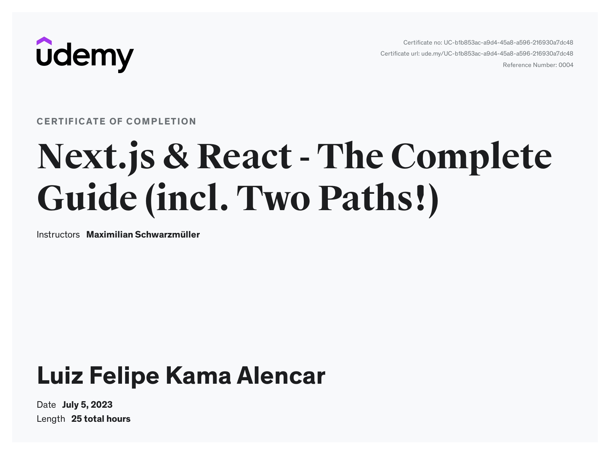

# Next.js & React - The Complete Guide: Studies and Projects

This repository contains my studies and projects developed during the [Next.js & React - The Complete Guide](https://www.udemy.com/course/nextjs-react-the-complete-guide/) course on Udemy. The course covers everything from fundamentals to advanced topics in Next.js, including best practices for development with React and Next.js.

## Certificate

I successfully completed the course and received a certificate, which can be viewed [here](https://www.udemy.com/certificate/UC-b1b853ac-a9d4-45a8-a596-216930a7dc48/).

## Repository Content

This repository is organized into folders and files corresponding to different sections and projects of the course. Below is a description of each section and the main projects developed:

1. **Next.js Fundamentals**
    - Introduction to Next.js
    - Folder and file structure
    - Pages and navigation

2. **Rendering in Next.js**
    - Server-Side Rendering (SSR)
    - Client-Side Rendering (CSR)
    - Static Site Generation (SSG)

3. **Routing and Navigation**
    - Dynamic routing
    - Links and programmatic navigation

4. **Styling and Components**
    - Global styles and CSS modules
    - Components and code reuse

5. **API Integration**
    - Fetching data with getServerSideProps and getStaticProps
    - API Routes in Next.js

### Example Projects

1. **Basic Blog**
    - Structuring a simple blog with Next.js
    - Implementing navigation between pages
    - Fetching data from an external API

2. **Events Application**
    - Events system with dynamic pages
    - API integration for event creation and listing
    - Custom styling and components

## Conclusion

This repository is a testament to my learning journey in ReactJS. Feel free to explore the projects and use them as references for your own learning.

If you have any questions or feedback, feel free to open an issue or contact me.

Happy coding!
